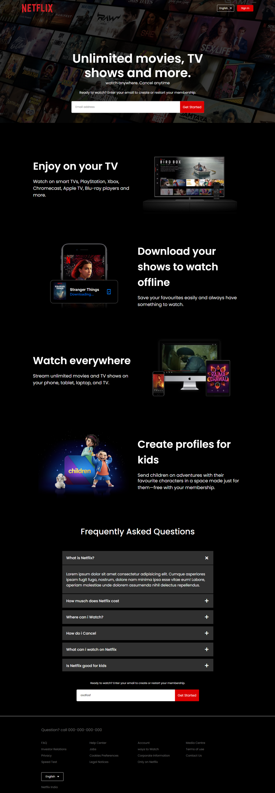

# Netflix Clone

A responsive Netflix clone built using HTML and CSS. This project mimics the homepage of Netflix, showcasing various features and sections such as a header, features, FAQ, and footer. It is fully responsive and adapts to different screen sizes.

## Table of Contents

- [Features](#features)
- [Technologies Used](#technologies-used)
- [Getting Started](#getting-started)
- [Usage](#usage)
- [Screenshots](#screenshots)
- [Contributing](#contributing)

## Features

- Responsive design
- Header with navigation
- Feature sections
- FAQ accordion
- Footer with multiple links

## Technologies Used

- HTML
- CSS

## Getting Started

To get a local copy up and running follow these simple steps.

### Prerequisites

You need a code editor, preferably VS Code, and a browser to view the project.

### Installation

1. Clone the repository:
    ```sh
    git clone https://github.com/Manikanta-484/netflix-clone.git
    ```
2. Open the project folder:
    ```sh
    cd netflix-clone
    ```
3. Open `index.html` in your preferred browser to view the project.

## Usage

- Modify `index.html` and `styles.css` to customize the project as needed.
- Add images to the `netflix-img/images` folder.

## Screenshots



## Contributing

Contributions are what make the open source community such an amazing place to learn, inspire, and create. Any contributions you make are **greatly appreciated**.

1. Fork the Project
2. Create your Feature Branch (`git checkout -b feature/AmazingFeature`)
3. Commit your Changes (`git commit -m 'Add some AmazingFeature'`)
4. Push to the Branch (`git push origin feature/AmazingFeature`)
5. Open a Pull Request
